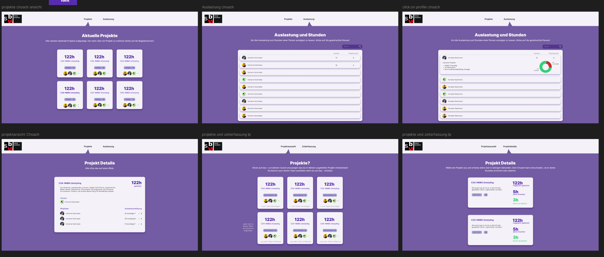
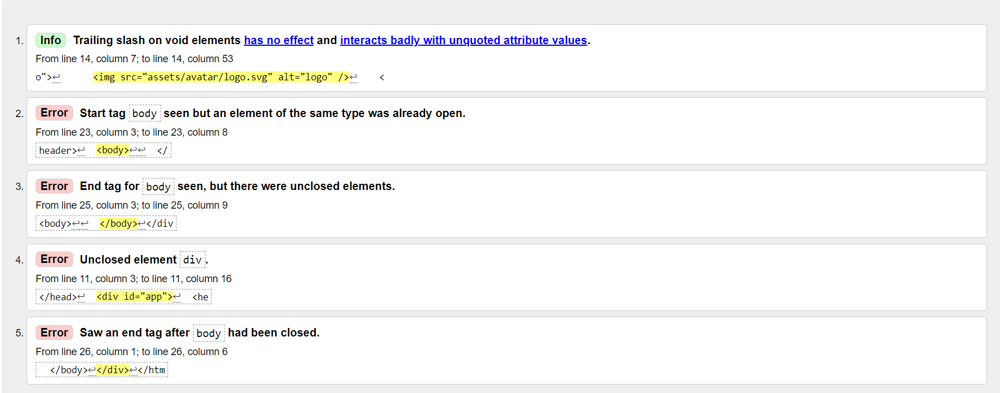

# M291

<br>
<br>
Wir haben gelernt das Vue doch nicht so einfach ist wie gesagt wurde. <br>
Wir konnten unsere html, css und javascript Horizonte erweitern <br>
und Vue versuchen zu verstehen. <br>
Alles in allem konnten wir viel lernen,
weinen, lachen und schreien. <br>
Aber am Schluss ist alles gut gekommen.
<br>
<br>
<br>
<br>
<br>


## Inhaltsverzeichnis

- [Ausgangslage](#ausgangslage)
- [Projektbeschreibung](#projektbeschreibung)
- [Steps](#steps)
- [Testing](#testing)
- [Probleme](#probleme)
- [Fazit](#fazit)

## Ausgangslage

Dies war unser (Serainas) Kentniss vor diesem Modul:

```bash
# Beispielbefehle
<!DOCTYPE html>
<html lang="en">

```
Und dies nach dem Modul:


## Projektbeschreibung

Für dieses Modul haben wir uns entschieden eine Wesbite zum Thema Stunden und Auszahlung zu machen. Dazu haben wir API's von der SBW verwendet, um Daten von Projekten und Schülern ohne viel Aufwand direkt zu erreichen.

## Steps
Wir aben als erstes unsere Ideen auf Blatt Papier gescribbelt und danach in Figma unser Mockup erstellt. Wir haben viel gelernt was das Ui/UX Design angeht und versucht die Site so User freundlioch wie möglich zu machen.

Als wir mit dem Coden vom Html und Css fertig waren haben wir diese mit dem Validator geprüft:

## Testing



## Probleme
Das Grösste Problem war es die vorprogrammierten Html und Css Dateien mit Vue so zu vereinen, dass das Css stimmt. Ich (Seraina) hatte im Vorhinein das Html und Css programmiert, währenddessen hatte Kevin mit Vue angefangen. Immer als ich mit einer Seite Html fertig war, wandelte er diese in Vue um. Wir waren sehr unerfahren und dachten dieser Weg wäre einfach und gut zum zusammenarbeiten, aber das Css hat so oft nicht mit dem neuen Code übereingepasst das die gesamte Arbeit von mir nutzlos war. Am Ende haben wir es geschafft irgendwie zu integrieren, aber wir mussten viel von unserem Code weglassen und die Website anders gestalten, Funktionen und Design Elemente entfernen.
Funktionen die nicht funktionieren:
Übergreifen des localStorages, Projektstunden werden leider nicht im Choach Mode angezeigt.
Team hinzufügen und entfernen funktioniert nicht.
Searchbar ist nicht funktionabel.

## Fazit

Wir programmieren nie wieder mit Vue.
